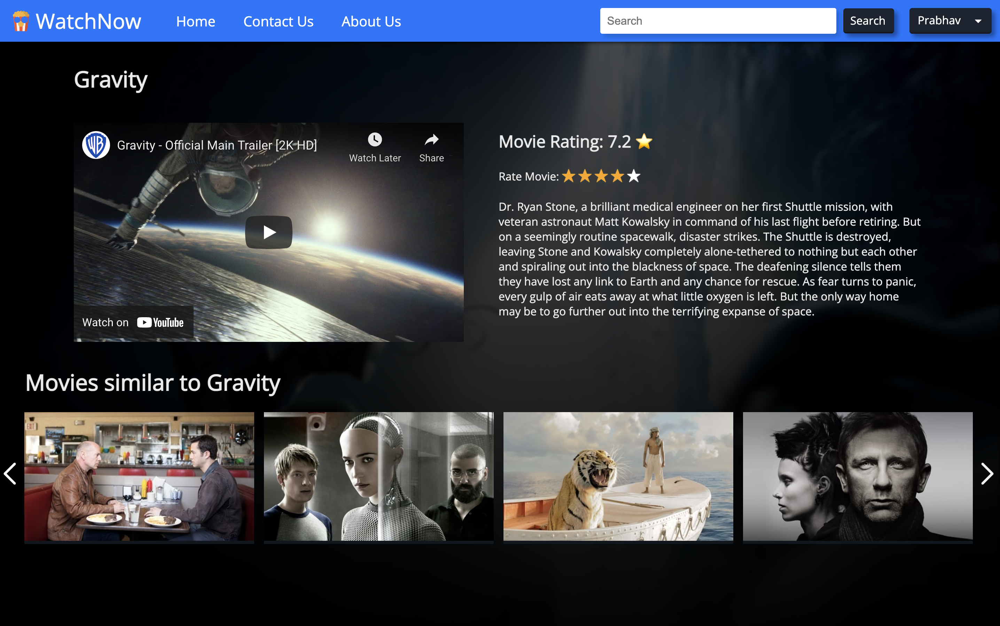

# Microsoft Engage Mentorship program'22 Project   
## Algorithms (Recommendation Engine)
### ⦾ Overview 
The purpose of the application is to demonstrate algorithms which are used to provide content-based recommendations, which ensures that the content you are watching is pleasing. This project is solely built during the period of the **Microsoft Engage Mentorship program '22**, conducted by Microsoft to provide mentorship and to enrich freshmen with various software development techniques.
#### Problem statement (as given)
Demonstrate through your app the different kinds of algorithms that a web-streaming app (like Netflix) or an audio-streaming app (like Spotify) may use for their recommendation engine.

- [x] Status: Accomplished by making a KNN model that recommends movies based on user data or a given movie. 

##### Adopt feature:
To make an app that is fully functional and demonstrates how algorithms work in a recommender system.  
- [x] Status: Accomplished   


 

<!-- under development -->
## 🔗 Links for project:
 Project **Demo** link: [Google Drive](https://drive.google.com/file/d/1VZGbVb22E3iyShx92yYovf7QZZwndAzw/view?usp=sharing)  
 **Dataset** Link: [MovieLens Tag Genome Dataset 2021](https://files.grouplens.org/datasets/tag-genome-2021/genome_2021.zip)  
 Link for **project + data rendered** [https://drive.google.com/file/d/1wAbMEeL7ucFc2g5OJRzIe38LUOEsWH7X/view?usp=sharing](https://drive.google.com/file/d/1wAbMEeL7ucFc2g5OJRzIe38LUOEsWH7X/view?usp=sharing)

## 🌐 Web flow
<!-- under development -->


## ⦾ Agile methology and workflow:

The Agile methodology was followed by the implementation of the KNN algorithm on the PCA transformed data, which was earlier preprocessed in the jupyter-notebook. The methods were performed using the git version control system and successfully developed patches which were merged into the main branch. Methods were performed according to the priority scale given below:
Priority scale: P5 (highest) to P1 (lowest).
| Week | Task                                                                                                                                                                                                                                                                                                  | Remarks                                                                                                                                                                         |
| ---- | ----------------------------------------------------------------------------------------------------------------------------------------------------------------------------------------------------------------------------------------------------------------------------------------------------- | ------------------------------------------------------------------------------------------------------------------------------------------------------------------------------- |
| 1    | **App design phase**  <br><br>P5: Use Django templates to create a basic app layout. <br> P4: Searched data analysis technologies. <br>  P3: Investigate data available on the internet.                                                                                                              | Rough analysis of the problem statement                                                                                                                                         |
| 2    | **Design layout phase**<br><br>P5: Analysis of data <br> P4: Exploring data tools and methods <br> P3: Cleaning and parsing of data <br> P2: KNN Model creation                                                                                                                                       | Data was analysed and work complexity was evaluated.                                                                                                                            |
| 3    | **Phase of DataAPI Implementation** <br><br>P5: After Standard Scaling and Principle Component Analysis (PCA), the model was trained. <br> P4: Views (Django) for interface implemented <br> P3: Views (Dataapi) for API implemented <br> P2: Templates (Django) are laid for proper viewing in HTML. | Major functionalities are added which consists of K Nearest Neighbours and other rating based sorting algorithms along with Principle Component analysis to make it run faster. |
| 4    | **CSS and Interface Implementation Phase**<br><br>P5: Bugs have been reduced<br>P4: CSS Enhancement<br>P3: Minor functionalities have been added.                                                                                                                                                     | Overall improvement in UX/UI of the app                                                                                                                                         |
## ⦾ Features:
| Features                                                                                                                                            | Images                                                                                                                                                                                                                                                                                                                                                                                                                     |
| --------------------------------------------------------------------------------------------------------------------------------------------------- | -------------------------------------------------------------------------------------------------------------------------------------------------------------------------------------------------------------------------------------------------------------------------------------------------------------------------------------------------------------------------------------------------------------------------- |
| **Homepage** <br>Interact with movies, watch movie details, made with CSS \| Javascript \| JQuery                                                   |                                                                                                                                                                                                                                                                                                                 |
| **Moviepage** <br> There is a whole dedicated page for movies where users can rate the movies, watch trailers, and find movies similar to the movie |                                                                                                                                                                                                                                                                                                                      |
| Search movies in the navigation bar                                                                                                                 |                                                                                                                                                                                                                                                                                                                         |
| User authentication system with the security of the Django framework                                                                                | <br>**Logged In**  <hr><br> **Log Out from here**  <hr> <br>**Logged Out and can Sign in or Sign up again**  |
| A dedicated contact page for answering user queries                                                                                                 |                                                                                                                                                                                                                                                                                                                        |
| Change your password or overview your profile.                                                                                                      |                                                                                                                                                                                                                                                                                                                       |
| Login and rate movies.                                                                                                                              |                                                                                                                                                                                                                                                                                                                      |

**Other Features:**
1. Change some sections of their profile (email change).
2. Get suggestions based on which movies they liked.
3. It contains an administration section which can control other profiles. 
4. The data includes movies from 2000–2019, so users are more familiar with them.

##  ⦾ Technologies used:
#### Programming Languages:  
#### Version Control:   

####  Frameworks/Libraries:  
#### Refferences used: 
#### Data & API source: 
#### IDE's used: 
#### Acknowledgements
========================  
We would like to thank GroupLens for providing us with the dataset and code for the regression algorithm [Vig et al., 2012]. We would also like to thank organizations that supported publication of this dataset: the Academy of Finland, grant #309495 (the LibDat project) and the Academy of Finland Flagship programme: Finnish Center for Artificial Intelligence FCAI.

###### You can also see the list of python dependencies in requirements.txt file.

## ⦾ Installation/Environment Setup 
  Note that python --version should be 3.6 and above.
  #### 1. Clone App
  * Make a new folder and open the terminal there.
  * Write the following command and press enter.
  
  ```
    $ git clone https://github.com/prabhavagrawal7/watchnow.git
  ```
  ### 2. Enter in the **watchnow** folder.
  ``` 
  $ cd watchnow
  ``` 
  ### 3. Use Virtualenv to create and activate a virtual environment.
  * For linux/unix users:  
```
$ python3 -m pip install --user virtualenv
$ python3 -m venv env
$ source env/bin/activate
``` 
  * For windows users: 
```
$ py -m pip install --user virtualenv
$ py -m venv env
$ .\env\Scripts\activate
```
  ### 4. Install the required Python packages by following this command.
  * For linux/unix users:  ```pip3 install -r requirements.txt```
  * For windows users: ```pip install -r requirements.txt```
  ### 5. Migrate the database ¸
  * For linux/unix users
  ``` 
  $ python3 manage.py migrate
  ``` 
  * For windows users 
  ```
  $ python manage.py migrate
  ```
  ### 6. Now run the server as usual.
  * For linux/unix users
  ``` 
  $ python3 manage.py runserver
  ``` 
  * For windows users 
  ```
  $ python manage.py runserver
  ```
## ⦾ Future Scopes:
| Feature                                                                                                                                                                                                                               | Explanation                                                                      |
| ------------------------------------------------------------------------------------------------------------------------------------------------------------------------------------------------------------------------------------- | -------------------------------------------------------------------------------- |
| Links to subscription services where you can rent or purchase movies                                                                                                                                                                  | It will help users directly find movies and watch them comfortably.              |
| Instead of adding just one trailer link, there are multiple trailers and teasers too.                                                                                                                                                 | It will eventually increase user convenience.                                    |
| The data is static, i.e. more movie data can't be added due to project size constraints. Instead, make it dynamic by fetching movies from the internet using the TMDb API and the ratings data is being taken directly from the user. | The data will become dynamic, so the project will be beneficial in the long run. |


### I would like to thank Microsoft for providing such a wonderful mentorship experience.
